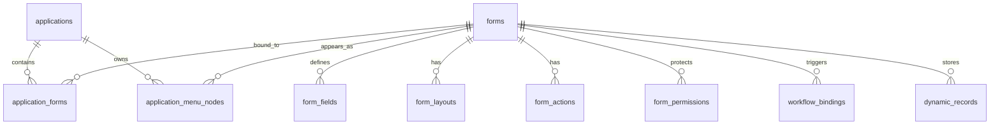

# Low-Code Platform Architecture

Last updated: 2026-05-25

Status: current implementation plus design notes. For the canonical endpoint
list, use `docs/development/api-reference.md`.

This document explains the low-code layer: applications, forms, menu assembly, actions, permissions, workflow bindings, and dynamic records.

## 1. Core Concepts

| Concept | Meaning |
| --- | --- |
| Application | A business work package, such as production overview, maintenance, quality, or supply-chain risk. |
| Form | A reusable business object configuration. It describes fields, layouts, actions, and storage behavior. |
| Application-form binding | Makes a form available inside an application. |
| Menu node | Organizes how users navigate inside an application. A node may be a group or a form entry. |
| Dynamic record | A user-created record for a low-code form, stored as JSON/JSONB. |
| Form action | A button/action such as create, edit, delete, export, submit, or workflow trigger. |
| Workflow binding | Connects a form action to a workflow definition. |

## 2. Current Persistence Status

The basic low-code persistence layer is implemented.

Implemented:

- migration `0006_platform_forms.py`
- migration `0008_saas_tenants.py`
- `/api/v1/forms`
- shared-database tenant isolation with `tenant_id`
- form metadata
- application-form bindings
- application menu nodes
- form fields
- layouts
- actions
- permissions
- workflow bindings
- dynamic records
- audit logging for core form and record mutations

Still evolving:

- advanced field types and validation UX
- richer permission inheritance
- bulk import/export for forms
- form physicalization for hot/high-volume forms
- full parity between older model-driven pages and the forms platform

## 3. Data Model



## 4. Storage Principle

Creating a form or field is metadata-only by default.

The platform writes configuration tables:

- `forms`
- `form_fields`
- `form_layouts`
- `form_actions`
- `form_permissions`
- `workflow_bindings`
- `application_forms`
- `application_menu_nodes`

It does not create a physical business table per form. Business data for custom forms is stored in `dynamic_records.data`.

This avoids uncontrolled DDL and keeps form design fast and reversible. Physicalization can be introduced later as an explicit admin-controlled operation.

## 5. Runtime Flow

```text
Admin creates application
  -> applications

Admin creates form
  -> forms
  -> optional application_forms binding

Admin adds fields
  -> form_fields

Admin configures page layout/actions
  -> form_layouts
  -> form_actions
  -> form_permissions
  -> workflow_bindings

Admin assembles menu
  -> application_menu_nodes

User opens app
  -> /api/v1/applications
  -> /api/v1/applications/{id}/menus

User opens dynamic form page
  -> /api/v1/forms/{form_id}
  -> /api/v1/forms/{form_id}/records

User creates/updates record
  -> dynamic_records.data
```

## 6. Current API Surface

All endpoints are mounted under `/api/v1/forms`.

| Capability | Endpoint pattern |
| --- | --- |
| Forms | `GET /`, `POST /`, `GET /{form_id}`, `PUT /{form_id}` |
| Fields | `POST /{form_id}/fields`, `PUT /{form_id}/fields/{field_id}`, `DELETE /{form_id}/fields/{field_id}` |
| Layouts | `GET /{form_id}/layouts`, `PUT /{form_id}/layouts/{layout_type}` |
| Actions | `GET /{form_id}/actions`, `POST /{form_id}/actions`, `PUT /{form_id}/actions/{action_id}`, `DELETE /{form_id}/actions/{action_id}` |
| Permissions | `GET /{form_id}/permissions`, `POST /{form_id}/permissions`, `PUT /{form_id}/permissions/{permission_id}`, `DELETE /{form_id}/permissions/{permission_id}` |
| Workflow bindings | `GET /{form_id}/workflow-bindings`, `POST /{form_id}/workflow-bindings`, `PUT /{form_id}/workflow-bindings/{binding_id}`, `DELETE /{form_id}/workflow-bindings/{binding_id}` |
| Records | `GET /{form_id}/records`, `POST /{form_id}/records`, `PUT /{form_id}/records/{record_id}`, `DELETE /{form_id}/records/{record_id}` |
| Application forms | `GET /applications/{application_id}/forms`, `PUT /applications/{application_id}/forms`, `DELETE /applications/{application_id}/forms/{form_id}` |
| Application menu nodes | `GET /applications/{application_id}/menu-nodes`, `POST /applications/{application_id}/menu-nodes`, `PUT /applications/{application_id}/menu-nodes/{node_id}`, `DELETE /applications/{application_id}/menu-nodes/{node_id}` |

## 7. Relationship To Model-Driven Module

The older model-driven module still exists under `/api/v1/model-driven`.

Use this distinction:

- **Model-driven**: metadata-driven CRUD around predefined/safe model names.
- **Forms platform**: application-owned low-code forms, field metadata, menu assembly, dynamic JSON records, workflow/action configuration.

They can coexist, but new application assembly and configurable forms should prefer the forms platform.

## 8. Palantir Mapping

| Foundry-style idea | Low-code platform equivalent |
| --- | --- |
| Workshop / operational apps | Applications and application menus |
| Object types | Forms and ontology-backed business objects |
| Object properties | Form fields and semantic metadata |
| Object actions | Form actions, rules, workflow bindings |
| Data-to-action loop | Records -> rules/workflows/notifications -> user action |
| Reusable operational tooling | Templates, reports, AI builder, config import/export |

## 9. Next Work

Recommended next implementation slices:

1. Make all application assembly UI paths prefer database-backed forms/menu nodes.
2. Add clear UI state labels for draft/published/archived forms.
3. Improve dynamic record indexing and filtering.
4. Add import/export for form packages.
5. Define when a form should remain JSON-backed and when it should be physicalized.

## 10. Large Dynamic Record Reads

Dynamic records now support two read styles:

- shallow compatibility pages: `page` + `page_size`
- scale-oriented pages: `cursor_after_id` or `cursor_before_id` + `page_size`

Production mode must avoid unbounded Python-side filtering. Search and structured filters should target fields marked as `searchable` or `sortable` in the form metadata. If a query cannot be pushed to the database safely, production should return a clear error rather than scanning a large tenant dataset in application memory.

For million-plus records per form, prefer cursor pagination and narrow filters. For tens of millions or more, create explicit PostgreSQL expression/generated-column indexes for hot fields. For very hot forms, introduce a physicalized read table while keeping the form metadata as the configuration source.
