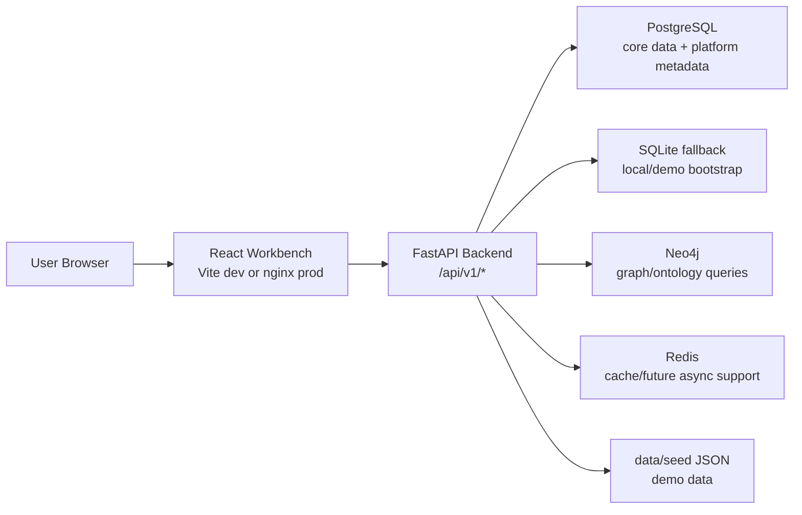
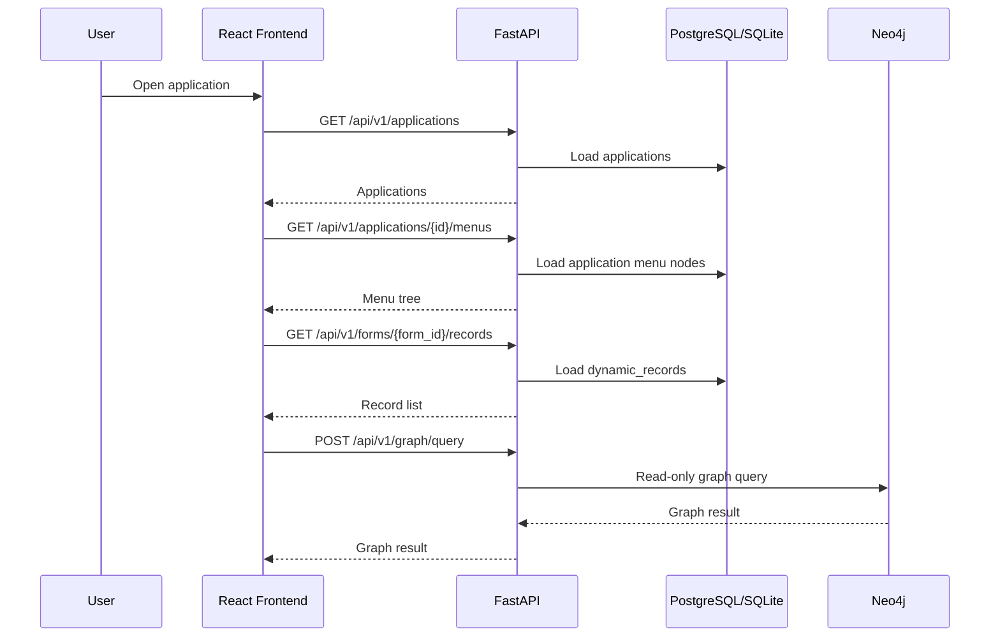

# ManuFoundry Architecture Overview

Last updated: 2026-05-25

This is the current high-level architecture document. It describes what the codebase implements now, and it separates that from Palantir-inspired reference direction.

## 1. Product Positioning

ManuFoundry is a manufacturing low-code analytics workbench. It borrows three important Palantir-style ideas and adapts them to manufacturing:

- **Ontology-first**: business objects such as equipment, work orders, inspections, suppliers, and materials should be understood through a shared semantic model.
- **Operational applications**: users work in role-oriented applications instead of raw tables or disconnected dashboards.
- **Data-to-action loop**: data, graph context, rules, workflows, notifications, and AI assistance should help users move from insight to action.

This project is a prototype, not a full Palantir clone. The current system implements a usable workbench shell, manufacturing APIs, low-code form metadata persistence, workflow/rules/reporting modules, and several Palantir-inspired design documents.

## 2. Current Technology Stack

| Layer | Current stack |
| --- | --- |
| Frontend | React 18, TypeScript 5.7, Vite 6, Ant Design 5, Ant Design Pro Components, Zustand |
| Visualization | ECharts, Cytoscape.js, cytoscape-dagre, ReactFlow |
| Backend | FastAPI 0.115, Uvicorn 0.34, Python 3.11, Pydantic 2, SQLAlchemy 2, Alembic |
| Relational database | PostgreSQL 16 in Docker; SQLite fallback for local/demo bootstrap |
| Graph database | Neo4j 5 community |
| Cache | Redis 7 |
| Analytics libraries | pandas, numpy, scipy, scikit-learn |
| Optional/future AI orchestration | Prophet, Celery, LangChain are commented in `requirements.txt` and not active runtime dependencies |
| Deployment | Docker Compose development stack plus production overlay |

## 3. System Context



## 4. Frontend Architecture

The frontend is a protected React single-page application.

Main responsibilities:

- Login and token restoration through `frontend/src/stores/authStore.ts`.
- Global shell in `frontend/src/App.tsx`.
- Workspace home route at `/`.
- Top application switcher.
- Application-specific side menu.
- Dynamic business pages under `/program/:programId`.
- Model/form-driven pages under `/dynamic/:slug`.
- System administration under `/system-admin`.
- Floating AI chat widget using `/api/v1/ai`.
- Centralized API client in `frontend/src/services/api.ts`.

Important frontend routes:

| Route | Purpose |
| --- | --- |
| `/login` | Login page |
| `/` | Workspace home |
| `/dashboard` | Production overview |
| `/maintenance` | Predictive maintenance |
| `/quality` | Quality analysis |
| `/supply-chain` | Supply chain risk |
| `/data-sources` | Data source management |
| `/ontology` | Ontology page |
| `/graph` | Graph explorer |
| `/pipeline` | Pipeline page |
| `/reports` | Report center |
| `/workflow` | Workflow center |
| `/templates` | Template marketplace |
| `/rules` | Rule engine |
| `/system-admin` | System administration |
| `/program/:programId` | Application program page |
| `/dynamic/:slug` | Dynamic model/form page |

## 5. Backend Architecture

The backend is a FastAPI application mounted around `/api/v1`.

System endpoints:

- `GET /`
- `GET /health`

Main API modules:

| Area | Prefix |
| --- | --- |
| Auth | `/api/v1/auth` |
| Admin | `/api/v1/admin` |
| Applications | `/api/v1/applications` |
| Forms platform | `/api/v1/forms` |
| Workflow | `/api/v1/workflow` |
| Data sources | `/api/v1/data-sources` |
| Ontology | `/api/v1/ontology` |
| Graph | `/api/v1/graph` |
| Pipelines | `/api/v1/pipelines` |
| Semantic assets | `/api/v1/semantic-assets` |
| Knowledge base | `/api/v1/knowledge` |
| Analytics | `/api/v1/analytics` |
| Maintenance | `/api/v1/maintenance` |
| Quality | `/api/v1/quality` |
| Supply chain | `/api/v1/supply-chain` |
| AI assistant | `/api/v1/ai` |
| Dashboard | `/api/v1/dashboard` |
| Reports | `/api/v1/reports` |
| Model-driven | `/api/v1/model-driven` |
| Rules | `/api/v1/rules` |
| Notifications | `/api/v1/notifications` |
| Templates | `/api/v1/templates` |
| Config import/export | `/api/v1/config` |
| Scheduler | `/api/v1/scheduler` |
| Search | `/api/v1/search` |
| AI builder | `/api/v1/ai-builder` |

## 6. Data And Persistence

The persistence layer has two major parts:

1. **Core manufacturing data**
   - Factories, workshops, production lines, equipment, sensors, work orders, inspections, defects, suppliers, materials, customers, and related seed data.
   - Modeled through SQLAlchemy models and seed JSON files.

2. **Low-code platform metadata**
   - Applications, application menus, roles.
   - Forms platform tables introduced by migration `0006_platform_forms.py`.
   - Dynamic form records stored as JSON/JSONB rather than creating a physical table for every user-defined form.

Forms platform tables:

| Table | Purpose |
| --- | --- |
| `forms` | Form/business object definition |
| `application_forms` | Application-form binding |
| `application_menu_nodes` | Application-specific menu tree |
| `form_fields` | Field metadata |
| `form_layouts` | List/detail/edit layout metadata |
| `form_actions` | Configurable action buttons |
| `form_permissions` | Role/action/field permission metadata |
| `dynamic_records` | JSON/JSONB records for dynamic forms |
| `workflow_bindings` | Bind form actions to workflow definitions |

## 7. Runtime Data Flow



## 8. Palantir Architecture Mapping

| Palantir-inspired idea | ManuFoundry implementation |
| --- | --- |
| Foundry Ontology | Ontology APIs, Neo4j graph, semantic asset APIs, manufacturing data model |
| Foundry Workshop / operational apps | Application switcher, application-specific menus, `/program/:programId`, workspace shell |
| Foundry Pipeline Builder | Data source management, pipeline APIs, scheduler APIs |
| Object actions | Form actions, rules engine, workflow bindings, notifications |
| Operational decision apps | Dashboard, maintenance, quality, supply-chain, workflow, reports |
| AIP-style assistance | Floating AI widget, `/api/v1/ai`, AI builder suggestions, local `/api/v1/knowledge` evidence retrieval |
| Gotham-style command UI | Event/risk workbench reference docs, notification center, graph impact/trace endpoints |

The important architectural lesson is not a visual copy of Palantir. The lesson is the **object-centric operating model**: users act on meaningful business objects, not disconnected screens.

## 9. Deployment Architecture

Development stack:

```bash
docker compose -f docker/docker-compose.yml up -d --build
```

Production-style stack:

```bash
docker compose -f docker/docker-compose.yml -f docker/docker-compose.prod.yml up -d --build
```

Production overlay behavior:

- Backend uses `backend/Dockerfile`.
- Frontend uses `frontend/Dockerfile`.
- Frontend serves static assets through nginx.
- Frontend host port `80` maps to container port `80`.
- Backend host port `8000` maps to container port `8000`.
- Source mounts are removed in production overlay.
- `DEMO_AUTH_OPTIONAL=false` in production overlay.

## 10. Current Boundaries

Implemented now:

- Workbench shell, app switcher, dynamic menus, workspace, system admin surfaces.
- Backend APIs for applications, forms platform, workflow, rules, reports, notifications, scheduler, search, templates, AI builder.
- Local knowledge base APIs with static demo documents, upload simulation, Markdown, cards, binding candidates, OCR workflow metadata, and TF-IDF retrieval.
- Forms metadata persistence and JSON dynamic records.
- Docker development and production-style compose files.
- Backend test coverage across security, workflow, rules, notifications, forms, config import/export, templates, scheduler/search/AI builder, graph safety, and model-driven safety.

Reference/planned:

- Full external LLM orchestration through LangChain.
- Celery or another real async job worker.
- TimescaleDB-specific time-series storage.
- Prometheus/Grafana observability stack.
- Kubernetes/Helm deployment.
- Full Gotham-style command center UX.
